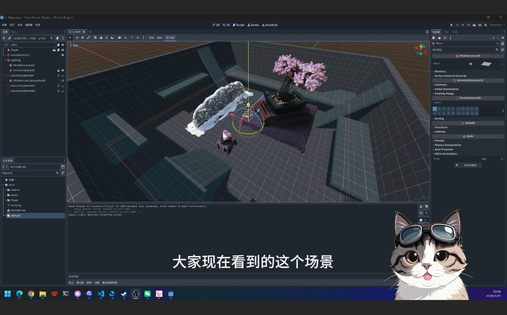

# gdgs: Godot Gaussian Splatting

作者：ReconWorldLab（重建世界LAB）

[English README](README.md)

`gdgs` 是一个基于 `CompositorEffect` 和 compute shader 的 Godot 4 Gaussian Splatting 插件。

它可以导入符合要求的 3D Gaussian Splat `.ply` 资源，通过 `GaussianSplatNode` 放入 Godot 场景，并利用场景深度与常规 3D 内容进行合成。

## 演示

- 视频演示：[Bilibili - BV1NRwFzYEVc](https://www.bilibili.com/video/BV1NRwFzYEVc)

## 功能特性

- 将支持的 Gaussian Splat `.ply` 文件导入为 Godot 资源。
- 在同一个场景中渲染一个或多个 `GaussianSplatNode`。
- 通过 `WorldEnvironment.compositor` 将 Gaussian Splat 结果与标准 Godot 3D 场景合成。
- 基于场景深度进行遮挡混合。
- 支持编辑器预览和 gizmo 操作。
- 内置 alpha、颜色、GS 深度、场景深度和深度剔除遮罩等调试视图。

## 环境要求

- Godot `4.4` 或更新版本。
- 使用 `Forward Plus` 渲染后端。
- 支持 compute shader 的桌面 GPU 和驱动。
- 一个符合要求的二进制 Gaussian Splat `.ply` 文件。

## 安装方法

1. 如果你的 Godot 项目中还没有 `addons` 目录，先创建它。
2. 将本仓库中的 `gdgs` 文件夹复制到你的项目中，目标路径应为 `addons/gdgs`。
3. 用 Godot 打开项目。
4. 进入 `Project > Project Settings > Plugins`。
5. 启用 `gdgs` 插件。

安装完成后，插件根目录应位于 `res://addons/gdgs`。

## 快速开始

1. 将一个支持的 `.ply` 文件加入项目。本仓库附带了 `demo.ply` 作为示例资源。
2. 等待 Godot 将其导入为资源。
3. 在场景中添加一个 `GaussianSplatNode`。
4. 将导入后的资源赋值给 `GaussianSplatNode` 的 `gaussian` 属性。
5. 在场景中添加一个 `WorldEnvironment` 节点。
6. 在 `WorldEnvironment.compositor` 上创建一个 `Compositor` 资源。
7. 在该 `Compositor` 中添加一个 `CompositorEffect`，并将其脚本设置为 `res://addons/gdgs/postprocess.gd`。
8. 运行场景。

## 场景说明

- `GaussianSplatNode` 只负责持有变换和资源引用，实际渲染由 compositor pass 完成，而不是走 Godot 标准 mesh 渲染管线。
- 当前支持多个 `GaussianSplatNode`，它们会在同一个 Gaussian pass 中统一渲染。
- 如果你替换了源 `.ply` 文件内容，请在 Godot 中重新导入，确保生成资源与源文件保持同步。

## 后处理参数

compositor effect 脚本位于 `res://addons/gdgs/postprocess.gd`。

- `alpha_cutoff`：alpha 低于该阈值的像素会在最终合成时被忽略。
- `depth_bias`：GS 深度与场景深度比较时使用的小偏移量。
- `depth_test_min_alpha`：只有当 GS alpha 高于该阈值时才应用深度剔除。
- `debug_view`：调试输出模式。

`debug_view` 可选项：

- `Composite`：最终合成结果。
- `GS Alpha`：Gaussian alpha 缓冲。
- `GS Color`：Gaussian 颜色缓冲。
- `GS Depth`：Gaussian 深度缓冲。
- `Scene Depth`：场景深度缓冲。
- `Depth Reject Mask`：显示哪些 GS 像素因为深度测试被剔除。

## 支持的 PLY 格式

导入器要求 Gaussian Splat PLY 至少包含以下属性：

- 位置：`x`、`y`、`z`
- DC 颜色系数：`f_dc_0`、`f_dc_1`、`f_dc_2`
- 其余 SH 系数：`f_rest_0` 到 `f_rest_44`
- 不透明度：`opacity`
- 缩放：`scale_0`、`scale_1`、`scale_2`
- 旋转：`rot_0`、`rot_1`、`rot_2`、`rot_3`

这个导入器面向 3D Gaussian Splatting 风格资源，不适用于普通点云 `.ply` 文件。

## 仓库结构

- `gdgs/`：本仓库中的插件根目录。安装到 Godot 项目后应位于 `addons/gdgs`。
- `gdgs/gaussian`：PLY 导入器和 Gaussian 资源定义。
- `gdgs/node`：场景节点和编辑器 gizmo。
- `gdgs/rendering`：渲染管理器、渲染上下文和 compute shader。
- `gdgs/postprocess.gd`：compositor effect 入口。
- `demo.ply`：用于导入测试的示例 Gaussian 资源。

## 已知限制

- 当前插件仅面向桌面端 `Forward Plus` 渲染。
- 渲染依赖 Godot 的 compositor 和 compute 管线，因此不支持 compatibility 和 mobile 渲染器。
- 当前渲染管理器仍以共享的 root 级运行时管理器存在，复杂的编辑器多场景或多视口工作流可能还需要进一步验证。
- 导入器依赖固定的 Gaussian Splat 属性布局。

## 致谢

- 本项目中的 shader 实现参考了 [2Retr0/GodotGaussianSplatting](https://github.com/2Retr0/GodotGaussianSplatting)。感谢 2Retr0 公开这个项目。
- 上游 `2Retr0/GodotGaussianSplatting` 仓库公开标注为 MIT License。如你继续复用与该参考实现密切相关的衍生内容，请同时查看并保留相应的上游许可证声明。
- radix sort 相关 shader 文件也保留了各自的上游来源说明，具体可见 shader 源文件头部注释。

## 参考

- [2Retr0/GodotGaussianSplatting](https://github.com/2Retr0/GodotGaussianSplatting)
- [3D Gaussian Splatting for Real-Time Radiance Field Rendering](https://arxiv.org/abs/2308.04079)

## 许可证

本项目采用 [MIT License](LICENSE)。
